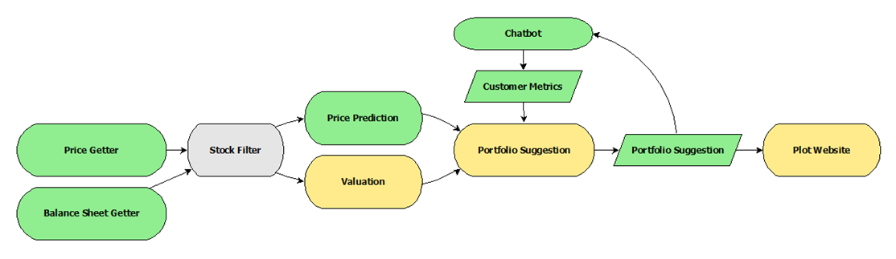
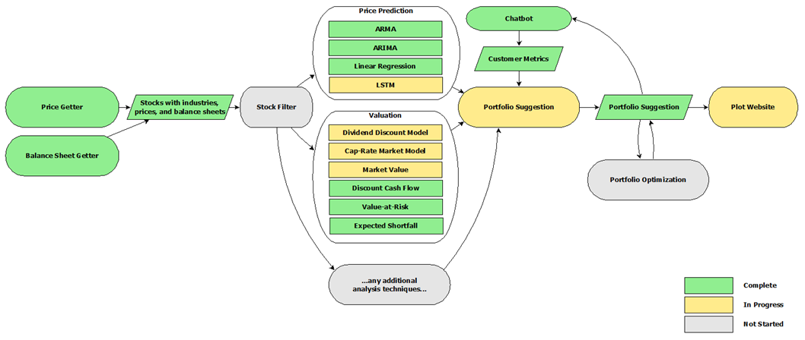

# **Project2**

# **Summary**

The goal of the Litquidity project is to produce an automated portfolio design platform for stock investments.

The framework is intended to provide a springboard for future work including portfolio optimization additional analysis methods.

# **Description**

The full platform solution consists of the following parts:

* Offline Testing
* Deployed Solution
* Documentation

## **Offline Testing**

Testing and R&D was performed in Jupyter notebooks using Pyviz visualizations.

## **Deployed Solution**

The portfolio recommendation is started off with an Amazon Lex chatbot. Answers from the customers are used to drive basic risk and exposure for the portfolio. Backend logic consists of a multi-module Python project executed on an Amazon Lambda instance. Large file storage is supplied by Amazon S3.

The internal logic consists of the following core components:

- Chat bot: 
- External data interfaces
- Price prediction: 
- Company valuation
- Portfolio suggestion function
- Website

Connectivity and implementation status of each component is shown below.

**Platform Architecture - Simple**


## **Documentation**

Documentation includes a PowerPoint presentation and ReadMe.md file.

# **Project Details**

## **Offline Testing**

Offline testing notebooks and data are stored in the `notebooks` directory.


## **Deployed Solution**

### **Detailed Architecture**

The internal components are shown in the detailed diagram below.

**Platform Architecture - Full**


The Python project is organized into modules underneath the src/main directory.

src/lambda_function.py serves as the launch point and is called by Amazon Lambda.

### **Unit Testing**

Unit tests ensure functionality for critical internal components. Tests are stored in the src/test directory.

One integration test that executes the high-level function is inside src/test_lambda_function.py.

### **Building and Deploying**

The build script `build-and-deploy-aws-package.sh` provides packaging and deployment of the Amazon Lambda function.

During testing a data capacity constraint exists which prevents the deployment step. However the .zip package is manually uploaded to Amazon S3 and linked to the Amazon Lambda function.

### **Implementation Notes**

Platform development remains in constant development and the following notes are relevant:

* Supported securities are those provided by the Fmp Cloud data provider and are not inclusive of all available assets.
* Cryptocurrency integration into the main deployed solution, and integration of additional securities and markets, ramains in progress.

### **External Data APIs**

**Yahoo**

[Pandas DataReader](https://pandas-datareader.readthedocs.io/en/latest/#)

Yahoo provides price history data for stocks on the U.S. market.

**Fmp Cloud**

[Fmp Cloud](https://fmpcloud.io/documentation)

Fmp Cloud is used to acquire financial data including balance sheets.

**Kraken**

[Kraken API](https://www.kraken.com/en-us/features/api)

Kraken provides price history for cryptocurrencies.

## **Documentation**

Documentation items are stored in the following locations:

* **ReadMe.txt**: Provides a project overview.

* **doc/Project2_Presentation_final.pptx**: Presentation describing the project.

# **Configuration**

## **Offline Testing**

Offline testing involved use of Jupyter Lab notebooks and visualizations. Required Python dependencies and installation steps are listed below:

```bash
pip install alpaca-trade-api
pip install asyncio
pip install bokeh
pip install ccxt
pip install dash --upgrade
pip install dash --upgrade
pip install pandas
pip install pandas_datareader
pip install PyPortfolioOpt
pip install PyPortfolioOpt
pip install python-dotenv
pip install requests
pip install sklearn
pip install statsmodels
pip install yahoofinance
```

## **Deployed Solution**

The following Python packages are required to run the source code:

```bash
pip install alpaca-trade-api
pip install pandas
pip install python-dotenv
pip install requests
pip install statsmodels
```

# **TODO**

TODO Exclude cap rate

TODO DCF and DDM

TODO Document all functions

TODO Apply checks for data types etc. inside all functions

TODO Bounds testing unit tests
